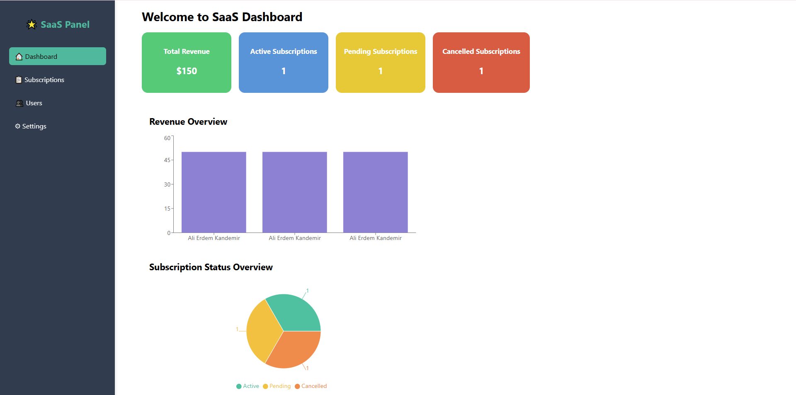
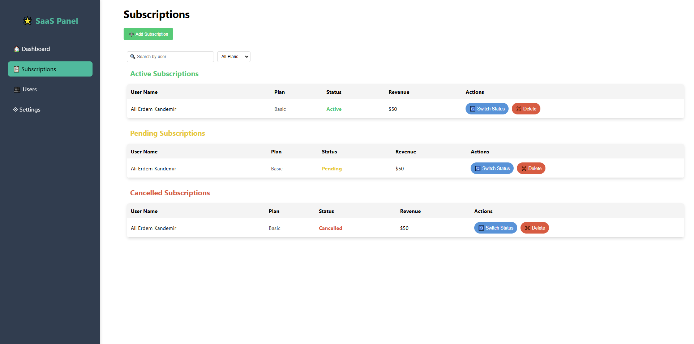

# 📊 SaaS Dashboard

SaaS Dashboard is a modern, responsive, and user-friendly dashboard designed for SaaS applications. It provides real-time data visualization, user management, and detailed analytics.

## 🚀 Features

- 🌟 **User-Friendly Interface:** Intuitive and clean design.
- 📈 **Analytics & Reports:** Interactive graphs and reports.
- 📱 **Responsive Design:** Optimized for desktop, tablet, and mobile devices.

## 📸 Screenshots

### 🌟 Dashboard View

### 📊 Subscription Overview

## 🛠️ Tech Stack

- ⚛️ **React:** Component-based UI.
- 🌐 **Redux Toolkit:** State management.
- 💅 **Styled Components / CSS:** Custom styling.
- 📊 **Chart.js / Recharts:** Interactive data visualization.
